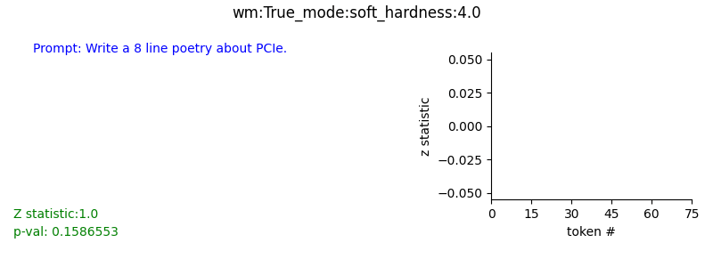
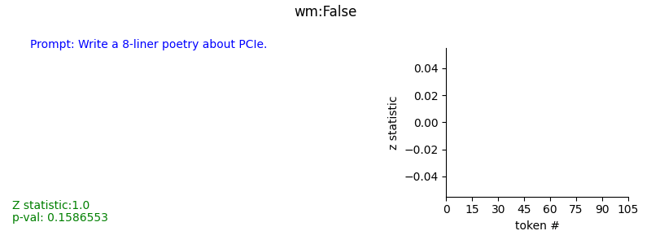
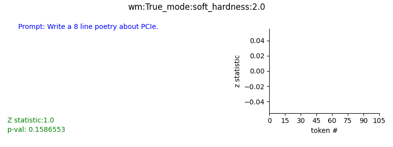
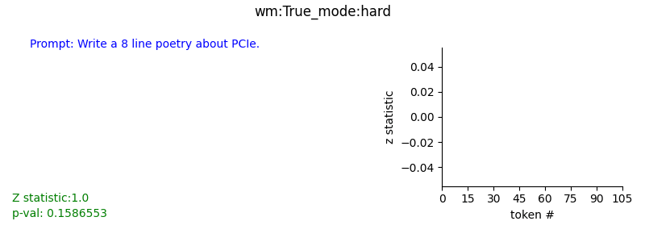

## Re-Implementation of  [``A watermark for Large Language Models``](https://arxiv.org/pdf/2301.10226.pdf)  [ [https://arxiv.org/pdf/2301.10226.pdf](https://arxiv.org/pdf/2301.10226.pdf) ]

####  The watermark works by selecting a randomized set of “green” tokens, seeded on the conditioning tokens before a word is generated and then softly promoting use of these green tokens during sampling.  
#### A statistical test is used for detecting the watermark with interpretable p-values.


---
### Demo  


---


### Details of Algorithm: Text Generation with Soft Red List 

#### Input:
- $s^{(−Np)} \ldots s^{-1}$ prompt of length $N_p$
- $\gamma \in(0,1)$ `green list size`
- $\delta > 0$  `hardness parameter`

#### Output:  
- $s^{(0)} \ldots s^{(T)}$ token generated by language model.

- for $ t = 0,1, \ldots $ **do**
    1. Apply the language model to prior tokens $ s^{(−Np)} \ldots s^{(t-1)}$  to get a logit vector $l^{(t)} $ over the vocabulary.
    2. Compute a hash of token $s^{(t-1)}$.  
    Use it to seed a RNG.
    3. Using this RNG, randomly partition the vocabulary into:  
    a **green list** $G$ of size $ \gamma |V| $ and  
    a **red list** $R$ of size $ (1−\gamma)|V| $
    4. Add $\delta$ to each green list logit.   
    Apply the softmax operator to these modified logits to get a probability distribution over the vocabulary.  
$\hat{p}_{k}^{(t)} = 
\left\{ 
    \begin{array} {rcl}
    \frac
        { \exp ( l^{(t)}_k  + \delta)}
        {\sum_{i\in R} \exp (l^{(t)}_i) + \sum_{i\in G} \exp ( l^{(t)}_i + \delta)},
    & k \in G \\
    \frac
        { \exp ( l^{(t)}_k)}
        {\sum_{i\in R} \exp (l^{(t)}_i) + \sum_{i\in G} \exp ( l^{(t)}_i + \delta)},
    & k \in R
   \end{array} 
\right\}$
    5. Sample the next token, $s^{(t)}$ , using the water-marked distribution $\hat{p}^{(t)}$.


#### Detecting Watermarks:
  
- Null Hypothesis $H_0:$ The text sequence is generated w/ no knowledge if the red list rule.  
- The number of green list tokens, denoted $|s|_G$ has expected value $T/2$ and variance $T/4$.  
- For a One proportion z-test the z-statistic is  :
$z = \frac{2(|s|_G - T/2)}{\sqrt{T}}$  
- for an arbitrary $\gamma$, $z = \frac{(|s|_G - \gamma T)}{\sqrt{T \gamma (1 - \gamma)}}$

---

### Script Usage:
```
# Generate without watermark
python driver.py --user_prompt "Write a 8 line poetry about PCIe." --watermark False --gif_dest_path assets/

# Generate with Hard Red List watermarking rule.
python driver.py --user_prompt "Write a 8 line poetry about PCIe." --watermark True --watermark_mode hard --gif_dest_path assets/

# Generate with Soft Red List watermarking rule, and low hardness.
python driver.py --user_prompt "Write a 8 line poetry about PCIe." --watermark True --watermark_mode soft --hardness 2.0 --gif_dest_path assets/

#Generate with Soft Red List watermarking rule, and higher hardness.
python driver.py --user_prompt "Write a 8 line poetry about PCIe." --watermark True --watermark_mode soft --hardness 4.0 --gif_dest_path assets/
```

---

### Module Usage:
- Setup
    ```
    from watermark import WaterMark, WaterMarkConfig, WaterMarkDetector, wmGenerate

    model = ...       # some huggingface language model
    tokenizer = ...   # huggingface tokenizer

    wm_cfg = WaterMarkConfig(vocab_size=tokenizer.vocab_size, device=model.device)
    ```

- Set hard red list or soft red list 
    ```
    wm_cfg.soft_mode = True         # False for hard red list
    wm_cfg.hardness = 4.0           # set hardness for Soft-Red-List mode

    watermarker = WaterMark(wm_cfg)
    wm_detector = WaterMarkDetector(wm_cfg)

    user_prompt = 'write a 8 liner poetry about tensors.'

    prompt_ids, wm_output_ids = wmGenerate(
            model=model, 
            tokenizer=tokenizer, 
            prompt=prompt, 
            watermarker=watermarker, 
            max_length = 250,
            temperature = 0.7,
            do_sample = True)

    prompt = tokenizer.decode(prompt_ids.squeeze(0), skip_special_tokens=True)
    generations = tokenizer.decode(output_ids.squeeze(0), skip_special_tokens=True)
    ```

- Detection
    ```
    stats = wm_detector.detect(prompt, generations, tokenizer)
    ```
    - stats returns the followig keys for each generated token:
        - `index`: index of this token
        - `z_stat`: the test statistic.
        - `p_val`: p value associated with the test statistic.
        - `s_g`: number of tokens sampled from the green list.
        - `T`: total tokens generated (till this index).
        - `result`: result of watermark detection. True if watermeark detected.
        - `token_id`: id of the sampled token.

---

### Comparisons
- #### A `lower hardness value (1st Illustration)` vs `higher hardness value (2nd Illustration)` for soft-red-list mode can cause detection of watermarks with fewer tokens, at the cost of approaching a near greedy sampling.
    
    

- #### `Hard Red List (1st illustration)` completely stops sampling from the Red list, which can deteriorate geenration quality.
    #### `Soft Red List (2nd illustration)` allows sampling the high probability tokens, even if they appear in the Red List.
    
    